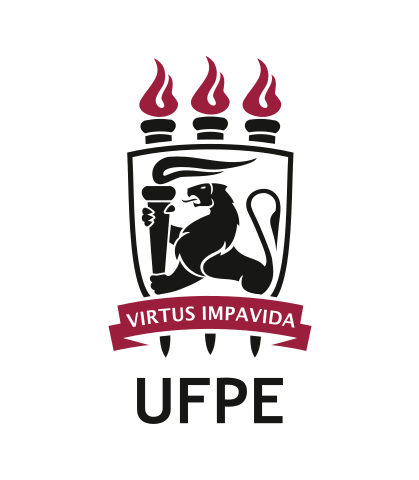
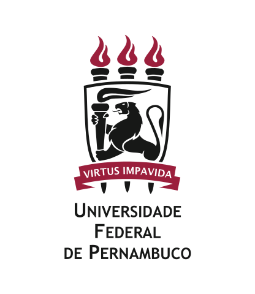

# Manual de Identidade Visual — UFPE

> Transcrição estruturada do **Manual de Identidade Visual da Universidade Federal de Pernambuco** ([PDF original](../manual_identidade.pdf), 58 páginas). Esta versão preserva a hierarquia, copy e dados técnicos do documento; imagens são referenciadas por caminho em `assets/`.

---

## Introdução

Este documento é uma atualização do Manual de Identidade Visual da UFPE e do seu Sistema de Identidade Visual. Foi concebido tendo como base o manual anterior e mantém a concordância com os valores institucionais representados visualmente pela marca principal — o brasão — e pelas assinaturas institucionais.

A manutenção da identidade visual da UFPE é responsabilidade de todos que fazem parte da Universidade, uma vez que requer esforço contínuo para que os padrões aqui descritos sejam seguidos de modo a preservar e valorizar a imagem da instituição.

A criação deste Manual cumpre o objetivo de padronizar a comunicação institucional em alinhamento com as estratégias de gestão e de comunicação da Universidade e com os critérios técnicos do design gráfico, tais como: pregnância, uniformidade, flexibilidade, viabilidade técnica, dentre outros (Gomes Filho, 2008).

---

## Sumário

**A Marca**
- [Assinaturas — principal e secundária](#marca--assinaturas--principal-e-secundária) — 04
- [Padrão tipográfico](#marca--padrão-tipográfico) — 06
- [Padrão cromático](#marca--padrão-cromático) — 07
- [Construção da marca](#marca--construção-da-marca) — 08
- [Malha construtiva](#marca--malha-construtiva) — 09
- [Área de proteção](#marca--área-de-proteção) — 10
- [Redução máxima](#marca--redução-máxima) — 11
- [Marca em negativo e positivo](#marca--marca-em-negativo-e-positivo) — 12
- [Aplicação em fundo colorido](#marca--aplicação-em-fundo-colorido) — 14
- [Aplicação cromática — usos incorretos](#marca--aplicação-cromática--usos-incorretos) — 16
- [Usos incorretos](#marca--usos-incorretos) — 17

**Assinaturas Institucionais**
- Pró-reitorias — 19
- Centros — 23
- Superintendências — 27
- Departamentos, programas de pós-graduações e núcleos — 31
- Assinaturas institucionais conjuntas — 35

**Submarcas** — 41

**Aplicações**
- Fotografias — 43
- Fotografias — usos incorretos — 45
- Ofício — 46
- Envelope pequeno — 48
- Envelope grande — 50
- Cartão de visita — 52
- Certificado — 53
- Redes sociais — avatar — 55

**Créditos** — 57
**Referências** — 58

---

## Marca | assinaturas | principal e secundária

De acordo com a professora Neide Câmara Grant, ligada ao Departamento de Design da UFPE, o primeiro brasão da Universidade Federal de Pernambuco foi desenhado por volta de 1950 e continha detalhes em vermelho, dourado e prata.

Na década de 1980, ao desenvolver um projeto de sinalização da Universidade juntamente com o professor Clóvis Parísio e o designer Domingos Sávio, ela, como responsável pela atualização da marca criou uma proposta de redesenho do brasão e de suas aplicações, com versões que chamaram atenção por manter as três cores, porém não mais utilizando detalhes coloridos, e sim três versões da marca, com maior equilíbrio do uso das três cores. Além disso na proposta apresentada, a relação entre o brasão e a tipografia foi reavaliada, e essa última passou a ser a fonte Optima.

> *"O brasão foi redesenhado respeitando as definições dos elementos originais e definindo as cores e a tipografia básica. O Sistema de Identidade Visual da UFPE passou a ser implantado pela editora na aplicação a impressos da administração central, centros, departamentos e núcleos da UFPE."*
>
> — **Neide Grandt**, Professora da UFPE

Na década de 1990, foi realizada mais uma renovação da marca: o brasão foi redesenhado, prezando pela simplificação dos traços, ocasionando mudança no estilo e posição do listel. As cores prata e dourado foram substituídas por preto e cinza, e a cor vermelha foi atualizada para o bordô. Além disso, a tipografia institucional passou a ser Trebuchet.

Essa versão do brasão é a atualmente em uso, na qual as chamas, que representavam as três áreas do conhecimento que deram início a história da UFPE — humanas, saúde e exatas —, hoje dão lugar à pesquisa, ensino e extensão, interpretação mais abrangente do papel da universidade pública na sociedade.

A imagem conta, ainda, com a figura do leão do norte, originalmente estampado no brasão de Duarte Coelho, datado de 1548. Esse símbolo remonta à história de luta do povo pernambucano, como a Batalha dos Guararapes e as revoluções Praieira e dos Mascates. Por fim, o lema *virtus impavida* (virtude impávida) surge escrito em seu listel.

A marca da UFPE apresenta **duas variações** cuja aplicação é determinada pelo nível de oficialidade ou pelo espaço ocupado pela imagem no layout onde será aplicada.

### Assinatura Principal
A versão principal, indicada para ser usada em qualquer suporte. O brasão respeita o conceito e a estrutura da versão original: as cores, a heráldica e o desenho. **Esta versão deve ser utilizada em qualquer material de comunicação, prioritariamente.**

> **Listel**: pequena bandeirola ou flâmula que se localiza por cima ou por baixo do escudo de um brasão de armas.

### Assinatura Secundária
Desenvolvida para o uso da marca em situações específicas, a assinatura secundária é indicada para ser utilizada preferencialmente em materiais de comunicação a serem visualizados fora do país.

---

## Marca | padrão tipográfico

A fonte oficial do Sistema de Identidade Visual é a **Trebuchet MS**. Ela foi criada pelo designer Vincent Connare, em 1996, para a Microsoft Corporation e está disponível na lista padrão de fontes do Windows.

No brasão que apresenta o nome da Universidade por extenso e nas assinaturas institucionais, o texto é usado na **versão versalete** da fonte oficial.

| Variante | Exemplo |
|---|---|
| Normal | `ABCDEFGHIJKLMNOPQRSTUVWXYZ abcdefghijklmnopqrstuvwxyz 1234567890!@#$%&¨*()_+-={}[]<>;:` |
| Negrito | **`ABCDEFGHIJKLMNOPQRSTUVWXYZ abcdefghijklmnopqrstuvwxyz`** |
| Itálico | *`ABCDEFGHIJKLMNOPQRSTUVWXYZ abcdefghijklmnopqrstuvwxyz`* |
| Negrito e itálico | ***`ABCDEFGHIJKLMNOPQRSTUVWXYZ abcdefghijklmnopqrstuvwxyz`*** |

> **Versalete**: letras minúsculas são representadas pelo mesmo desenho dos caracteres maiúsculos, variando apenas em altura.

---

## Marca | padrão cromático

As cores institucionais da UFPE são o **bordô** e a **cor preta**. Para garantir a conexão entre os materiais de comunicação, o uso das cores institucionais deve ser incorporado nos layouts como elemento identificador, juntamente com as demais normas deste manual.

### Bordô
| Sistema | Valor |
|---|---|
| Pantone | `201C` |
| CMYK | `C0 M100 Y63 K29` |
| RGB | `R162 G37 B56` |
| Hexadecimal | `#990000` |

### Preto
| Sistema | Valor |
|---|---|
| Pantone | `Black` |
| CMYK | `C0 M0 Y0 K100` |
| RGB | `R0 G0 B0` |
| Hexadecimal | `#000000` |

> **Nota técnica**: o RGB `R162 G37 B56` corresponde a `#A23738`, enquanto o hex impresso é `#990000`. Adotamos `#990000` como valor canônico por ser o que aparece como Hex oficial no manual.

---

## Marca | construção da marca

Manter a consistência da proporção gráfica da marca é importante para preservar a integridade visual. A medida escolhida para manter o equilíbrio visual da marca da UFPE é a **largura do brasão (`x`)**. Todas as medidas dos elementos e textos aplicam esta medida.

| Versão | Altura brasão | Largura texto | Distância (gap) | Régua |
|---|---|---|---|---|
| Sigla `UFPE` | `1.5x` | `0.7x` | `0.23x` | `x/10` |
| Por extenso | `1.5x` | `1.2x` | `0.53x` | `x/12` |

> O brasão deve estar centralizado em relação ao texto por extenso ou sigla.

---

## Marca | malha construtiva

A malha construtiva orienta a reprodução da marca quando a execução for manual. Grade de 5×7 quadrados de lado `x` para a versão sigla e 5×8 para a versão por extenso.

---

## Marca | área de proteção

Para maximizar sua presença visual, a marca requer uma área circundante livre de qualquer outro gráfico, elemento ou texto. A área de proteção mínima é baseada na **altura da chama do Brasão**.

---

## Marca | redução máxima

A consistência do tamanho da marca é importante para não comprometer a sua legibilidade.

| Versão | Redução mínima |
|---|---|
| Sigla UFPE | **2 cm** de largura |
| Por extenso | **2,5 cm** de largura |

---

## Marca | marca em negativo e positivo

A marca pode ser usada na cor preta em projetos monocromáticos e duotônicos quando o uso do bordô não for viável. A versão na composição das cores padrão deve ser priorizada, sempre que possível.

Escala de cinzas para fundos (Pantone Black, CMYK C0 M0 Y0 K{n}):

| Fundo | RGB | Hex |
|---|---|---|
| K100 | 0 0 0 | `#000000` |
| K90 | 26 26 26 | `#1A1A1A` |
| K80 | 51 51 51 | `#333333` |
| K70 | 77 77 77 | `#4D4D4D` |
| K60 | 102 102 102 | `#666666` |
| K50 | 128 128 128 | `#808080` |
| K40 | 153 153 153 | `#999999` |
| K30 | 179 179 179 | `#B3B3B3` |
| K20 | 204 204 204 | `#CCCCCC` |
| K10 | 230 230 230 | `#E6E6E6` |

---

## Marca | aplicação em fundo colorido

- **Em fundos de cores mais claras**: o Brasão permanece em suas cores originais (bordô + preto).
- **Em fundos de cores mais escuras**: o Brasão deve ser utilizado na cor branca.

---

## Marca | aplicação cromática | usos incorretos

- Não utilizar o Brasão em fundos escuros mantendo as cores originais (se mistura ao fundo).
- Não utilizar o Brasão em branco sobre fundos muito claros.
- Não aplicar efeito de transparência no Brasão.
- Não alterar as cores do Brasão.

---

## Marca | usos incorretos

A marca **não pode ser alterada ou redesenhada** para se adequar a uma determinada aplicação. **Não são permitidas** modificações nas cores, tamanho, elementos, linhas etc.

Restrições aplicáveis às versões **principal** e **secundária**:

- Não utilizar a marca sem a sigla ou sem o texto por extenso.
- Não distorcer a altura.
- Não distorcer a largura.
- Não inclinar.
- Não alterar o tamanho do texto.
- Não alterar o tamanho do Brasão.
- Não utilizar tipografia diferente da institucional.
- Não alterar as cores dos elementos nem da tipografia.
- Não espelhar os elementos.
- Não alterar a posição dos elementos.
- Não utilizar efeito de marca d'água.
- Não utilizar o texto sem o Brasão.
- Não utilizar elementos da marca separados.

---

## Assinaturas institucionais

O Sistema de Identidade da UFPE é composto pela sua marca (brasão com sigla ou nome por extenso) e pelas assinaturas institucionais dos centros, pró-reitorias, superintendências, departamentos, núcleos e programas de pós-graduação. Demais casos serão analisados pela Diretoria de Comunicação.

- As assinaturas institucionais devem **sempre** ser utilizadas juntamente com a marca da UFPE.
- **Não devem ser criadas novas assinaturas** de forma independente.
- Marca da UFPE à esquerda e, em seguida, a assinatura institucional.
- **Formatação**: siglas em letras maiúsculas, estilo **bold**; texto por extenso em **versalete**.
- Espaço máximo a ser ocupado horizontalmente: **5 chamas** na horizontal.

### Pró-reitorias (pág. 19)

| Sigla | Nome |
|---|---|
| `PROAES` | Pró-Reitoria para Assuntos Estudantis |
| `PROGEPE` | Pró-Reitoria de Gestão de Pessoas e Qualidade de Vida |
| `PROGRAD` | Pró-Reitoria de Graduação |
| `PROGEST` | Pró-Reitoria de Gestão Administrativa |
| `PROEXC` | Pró-Reitoria de Extensão e Cultura |
| `PROPESQI` | Pró-Reitoria de Pesquisa e Inovação |
| `PROPLAN` | Pró-Reitoria de Planejamento, Orçamento e Finanças |
| `PROPG` | Pró-Reitoria de Pós-Graduação |

### Centros (pág. 23)

Os centros acadêmicos da UFPE seguem o mesmo padrão de assinatura (brasão + sigla + nome por extenso em versalete). Lista completa em [pp. 23-26 do PDF](../manual_identidade.pdf).

### Superintendências (pág. 27)

Mesma estrutura — pp. 27-30 do PDF original.

### Departamentos, programas de pós-graduação e núcleos (pág. 31)

Mesma estrutura — pp. 31-34 do PDF original.

### Assinaturas institucionais conjuntas (pág. 35)

Quando há cooperação entre unidades, a assinatura combina as marcas respeitando hierarquia visual — pp. 35-40 do PDF original.

---

## Submarcas (pág. 41)

Submarcas são identidades visuais derivadas para programas, eventos ou projetos específicos da Universidade, que mantêm vínculo gráfico com a marca-mãe sem competir com ela.

---

## Aplicações

### Fotografias (pág. 43)
Diretrizes de uso, tratamento e seleção de imagens em peças institucionais.

### Fotografias — usos incorretos (pág. 45)
Filtros excessivos, recortes que descaracterizam o sujeito, baixa resolução etc.

### Ofício (pág. 46)
Modelo de papel timbrado padrão.

### Envelope pequeno (pág. 48)

### Envelope grande (pág. 50)

### Cartão de visita (pág. 52)
Frente e verso, posicionamento de marca, hierarquia de informação.

### Certificado (pág. 53)

### Redes sociais — avatar (pág. 55)
Versão circular/quadrada da marca para perfis institucionais.

---

## Créditos (pág. 57)

Diretoria de Comunicação / UFPE.

## Referências (pág. 58)

GOMES FILHO, João. *Gestalt do objeto: sistema de leitura visual da forma*. São Paulo: Escrituras, 2008.

---

> *Esta transcrição foi gerada como parte do design system `@ufpe/design-system`. Para o documento canônico, consulte sempre o [PDF oficial](../manual_identidade.pdf).*
